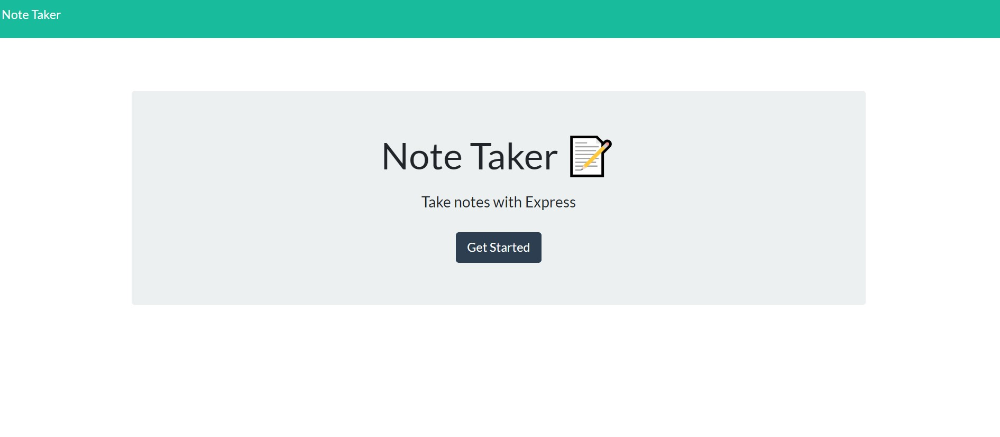
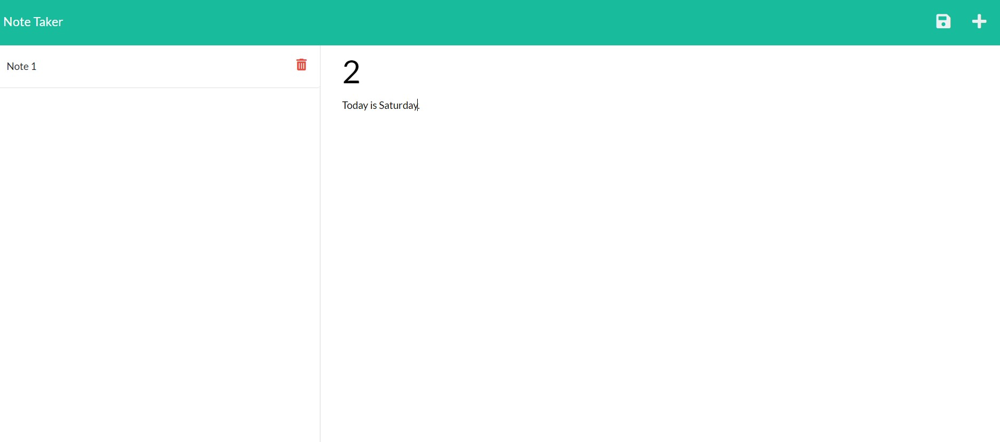

# Note-taker

## Description

- This application allows users to save notes and use it into their daily work.
- The user is presented with a landing page with a link to the notes page.
- The users can save their notes and also can delete anyone they want.
- The note titles are listed on the left-handed column while the new note empty field along with the write icon appears at the righ-handed column.

## Deployed application URL/Heroku

https://tranquil-castle-32766.herokuapp.com/

## Github repository URL

https://github.com/GhulamZaka/note-taker

## Screenshot

